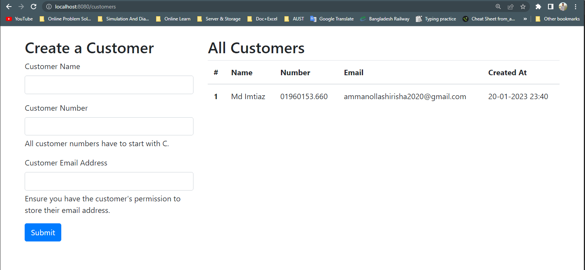
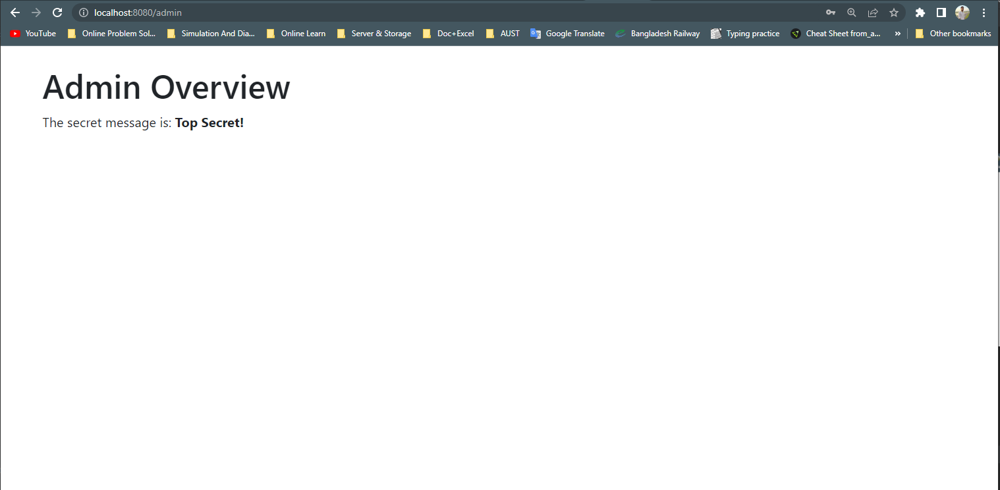

# Test Thymeleaf Controller Endpoints with Spring Boot and MockMvc 

Spring Boot offers excellent testing support for Spring Web MVC controllers. With the help of @WebMvcTest and MockMvc, we can verify our controller endpoints in isolation. This includes both API controllers (@RestController) as well as endpoints that return a server-side rendered view (@Controller). In this repo, we're going to focus on the latter. We'll demonstrate how to test controllers that return server-side rendered views using Spring Boot, Gradle, Java 17, and Thymeleaf. We'll cover HTTP GET and POST (form submission) requests and testing a secured view controller.

## Used tools
- Java- 17
- Gradle- 2.7.1
- IDE- Intellij Ultimate
- Language- Java
- Framework- Spring Boot

## http://localhost:8080/customers

## http://localhost:8080/admin

